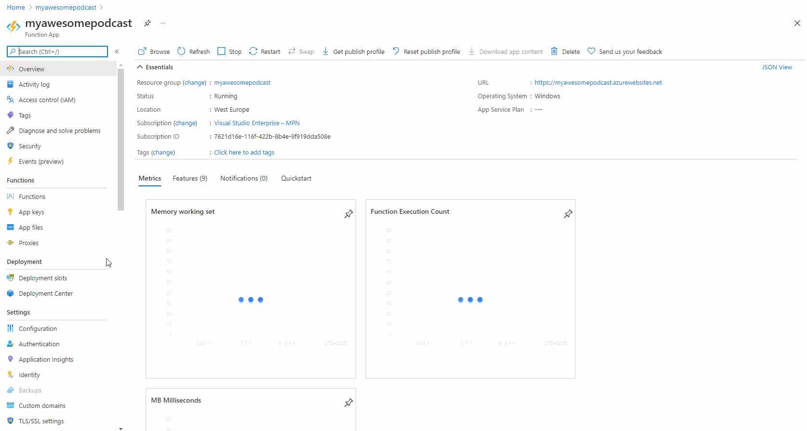
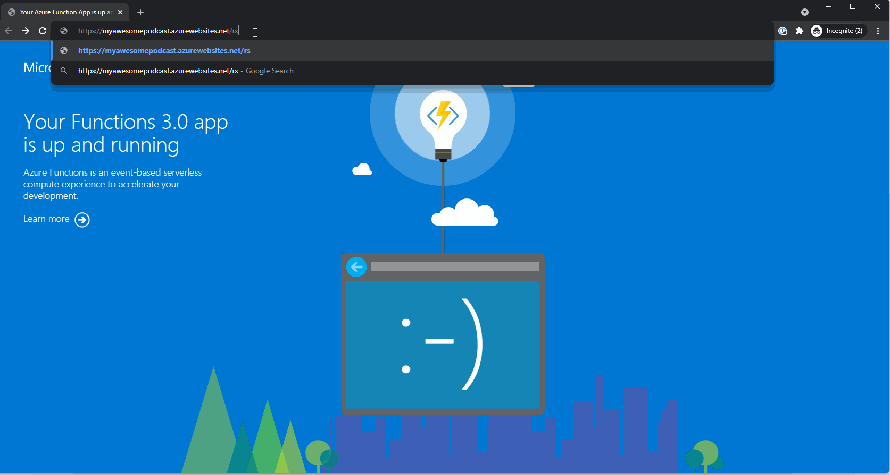

# Funcaster

<p align="center">

</p>

⚡ Serverless .NET solution for hosting your 🔊 podcasts with (nearly) zero costs using Azure Functions and Azure Storage Account. Now with integration with 💻 [FuncasterStudio](https://github.com/Dzoukr/FuncasterStudio)!


## Supported platforms
  

## How does it work
To start publishing your podcast you simply need two things: Public accessible storage for your audio files, and RSS feed providing information necessary information about podcasts and episodes in valid XML format. Only if we would have cloud-based services providing terabytes of storage for a ridiculously low price and service for providing an Http-based serverless API with millions of monthly invocations for free... Oh, wait! We have Azure Storage Account & Azure Functions! Yes, this solution does exactly that - checking your blobs (audio files) on your Storage Account and providing valid RSS XML over Azure Functions.

## Requirements

To use this solution you need to have access to Azure Portal and be logged in. If you don't have an account, you can [create one for free](https://azure.microsoft.com/en-us/free/).

## Pre-installation

You need to have binaries ready for deployment. You can easily [download the latest ZIP version](https://github.com/Dzoukr/Funcaster/releases) from Releases, or you can build your own by checkout this repository and running:

```cli
> dotnet tool restore
> dotnet run publish
```

Custom build output, as well as ZIP file, can be found in the `publish` folder on the root level of the solution. No matter which one you'll choose, get your ZIP file ready for deployment described in the next chapter.


## Installation

We will need to install and set up two things: Storage Account for your podcasts, and Azure Functions app for management around those files. It's pretty easy so just follow the steps and you are quickly done.

### Storage Account

#### 1️⃣ Create new Storage Account service

Once logged in Azure Portal, create a new Storage Account a wait for deployment is complete.


#### 2️⃣ Copy connection string

To connect serverless part of ⚡Funcaster with newly created Storage Account, you need to copy a connection string. Also remember it for using 💻 [FuncasterStudio](https://github.com/Dzoukr/FuncasterStudio) later.


Cool! Now everything is ready for the second part - Azure Functions.

### Azure Functions

#### 1️⃣ Create new Function App

Create a new Function app with any name you would like to use, select the same region your Storage Account is in, choose `.NET6` and proceed to creation. If you would like to have built-in monitoring, turn on the Application Insights.


#### 2️⃣ Setup connection string, runtime, and version

⚡Funcaster is built on `.NET6` using `dotnet-isolated` as worker runtime, which is equivalent to `~4` extension version. We need to check this is properly configured in configuration + add the connection string to the prepared Storage Account.



#### 3️⃣ Deploy ⚡Funcaster

Ok, let's deploy our ZIP file! There are many ways (CI solutions like GitHub Actions or Azure DevOps pipelines are preferred), but let's take the shortcut here and use the KUDU ZIP deployment running at `https://<NAME_OF_YOUR_FUNCTION_APP>.scm.azurewebsites.net/`


Great! Your solution is _almost_ ready! Now it's time to add some podcast content, can we?

## Using ⚡Funcaster with 💻 [FuncasterStudio](https://github.com/Dzoukr/FuncasterStudio)

Your podcasting solution is ready for serving files stored on blob storage. Let's start using it!! This the time when 💻 [FuncasterStudio](https://github.com/Dzoukr/FuncasterStudio) steps in as a great solution.

Just pull it as a Docker image from hub and run it locally using connection string to newly created storage acccount.

```cli
> docker run -p 1234:80 -e PodcastStorage="<CONNECTION_STRING>" dzoukr/funcasterstudio
```

Navigate to `http://localhost:1234` and start uploading episodes, podcast logo, and other stuff using 💻 [FuncasterStudio](https://github.com/Dzoukr/FuncasterStudio).


IT'S DONE! 🥳🎆🎊 Let's see how our RSS feed looks like. Navigate to https://<NAME_OF_YOUR_FUNCTION_APP>.azurewebsites.net/rss and behold!



### Using RSS feed

Now it's up to you where you wanna publish your podcast. I've already successfully published to [Spotify Podcasts](https://open.spotify.com/show/280aceAx85AKZslVytXsrB), [Apple Podcasts](https://podcasts.apple.com/us/podcast/podvocasem/id1590431276) and [Google Podcasts](https://podcasts.google.com/feed/aHR0cHM6Ly9mZWVkLnBvZHZvY2FzZW0uY3ovcnNz) but I'm pretty sure it will work for other providers too.

## FAQ

### Should I use this instead of Soundcloud?

It's up to you. Soundcloud offers great social features like likes, a built-in web player, and many more, but it costs over 8 EUR / months. If you just need to publish your podcast for (almost) zero costs, ⚡Funcaster is here at your service.

### What if I need an embedded player on my site?

Spotify and Apple offer an easy way of creating embedded players directly from the application or [marketing tools](https://tools.applemediaservices.com/). Or just use `<audio>` HTML5 tag.
